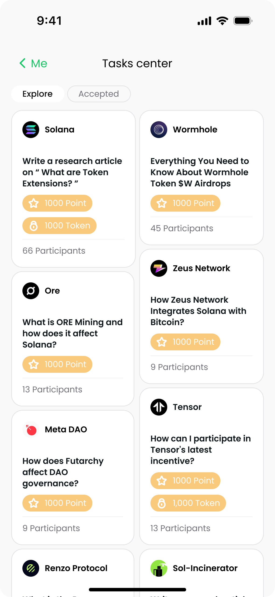

# Bloq: Transforming Airdrops into Real Impact

## Introduction
Bloq is a revolutionary platform focusing on the Consumer Apps track for Airdrops Driven Content Creation. Our mission is to make the Airdrops Economy in the Solana Ecosystem more efficient and beneficial, transforming the way airdrops are distributed and utilized.

## Features
- **UGC Powered Airdrop:** Set clear User-Generated Content (UGC) tasks for obtaining airdrops, ensuring value-driven engagement.
- **KPI Driven Airdrop:** Clear metrics quantify the value creation of the airdrop, making it user-friendly and effective.
- **Solana cNFT Integration:** Simplifies management, reduces costs, and enhances asset liquidity by integrating task-based cNFTs.
- **Synergy with Solana:** Bloq aims to bridge the gap between the Airdrop Economy and the UGC Economy, bringing new users to the Solana ecosystem.

## Tokenomics
Bloq connects the utility of the Protocol with the creativity of creators, reimagining the Airdrop Economy to provide an easy-to-use tool for Web3 projects to find their perfect "public advocates" and allowing Web3 Creators to transfer Crypto Value to Web2 Users rewardingly.

## Installation

## Contributing
We welcome contributions from the community. If you're interested in contributing to Bloq, please read our contributing guidelines and submit a pull request.

## Resources
- [Bloq BP](URL_TO_YOUR_DECK)
- [Web Product](URL_TO_YOUR_WEB_PRODUCT)

## License
(Include information about the license under which your project is distributed.)

